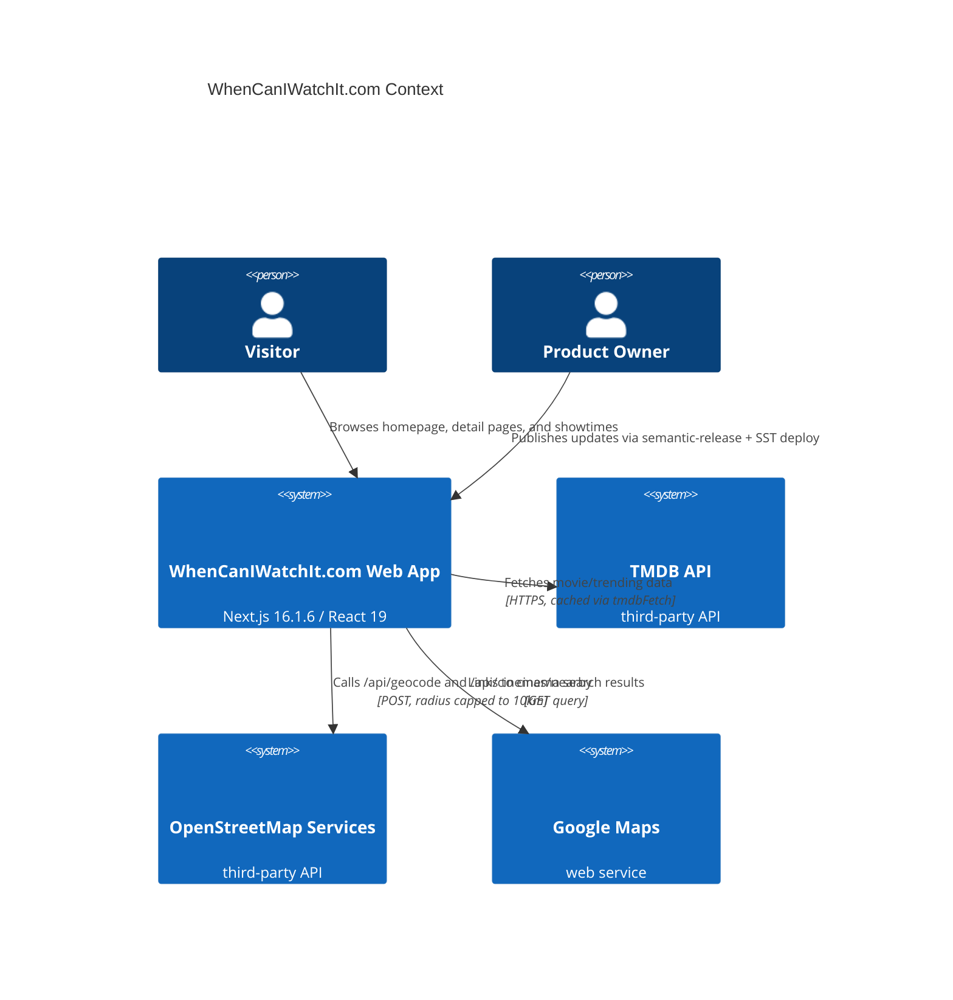
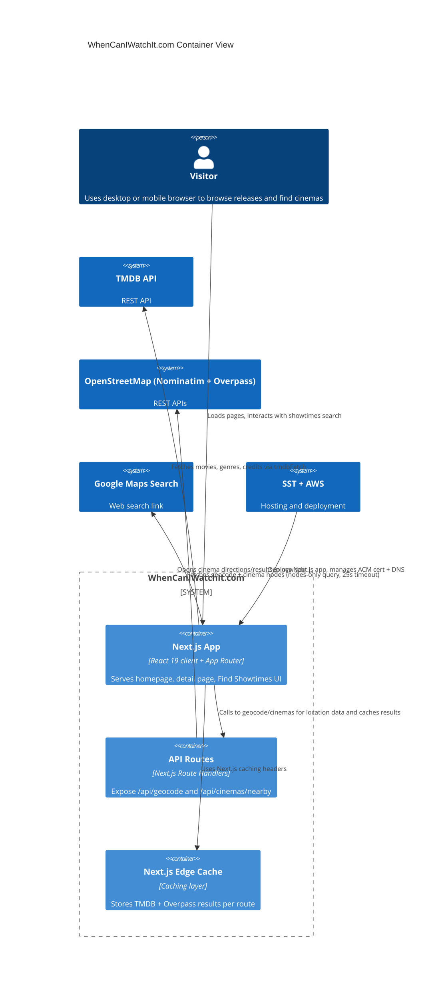

# C4 Overview – WhenCanIWatchIt Components

## Context
This diagram explains how the WhenCanIWatchIt.com experience is constructed for users, the Next.js application, and the third-party systems it relies on for content and location data.



## Containers & Components


## Key Components
- `components/FindShowtimes/FindShowtimes.tsx`: client component that handles geolocation, city search form, map toggle, and cinema list rendering.
- `components/FindShowtimes/NearbyCinemasMap.tsx`: Leaflet map (lazy loaded) visualizing center point, search radius, and cinema markers.
- `app/api/geocode/route.ts` and `app/api/cinemas/nearby/route.ts`: server routes validating input, capping radius, and forwarding requests to Nominatim/Overpass via `lib/osm.ts` helpers.
- `lib/osm.ts`: wrappers around OpenStreetMap APIs with `unstable_cache`, haversine distance calculations, and JSON parsing safeguards.
- `lib/tmdb.ts`: central TMDB fetch helper that sets `revalidate` TTLs, handles API key errors, and exposes `getUpcomingMovies`, `getTrendingTheatrical`, etc.
- `app/page.tsx` + `app/movie/[id]/page.tsx`: server components that orchestrate data fetching and slot in carousels, filters, and the Find Showtimes module.
- `sst.config.ts` + `.github/workflows/release.yml`: infrastructure that deploys the app to AWS via SST and automates release tagging with `semantic-release`.

```
Rationale: provide users and stakeholders with a single-bounded view of systems, the container responsibilities, and the key interactions that implement tracking and location discovery while highlighting third-party dependencies.
```
